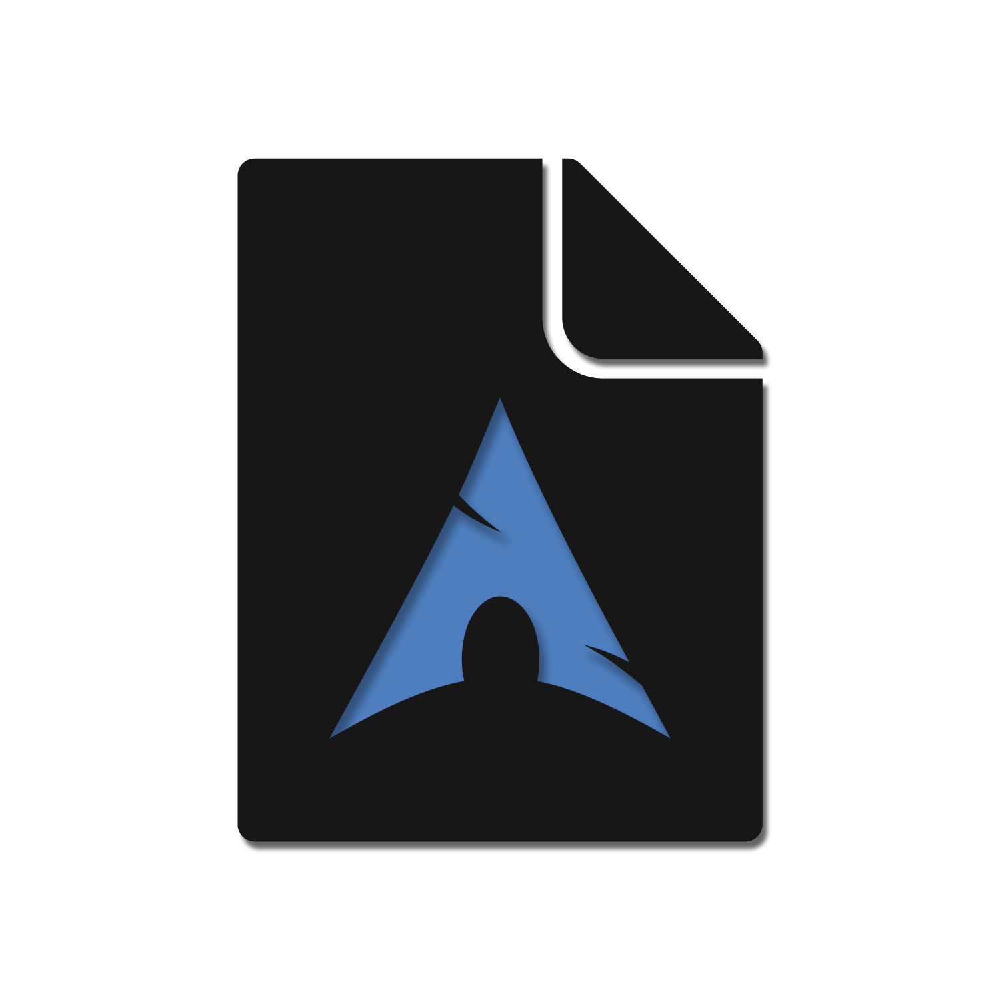
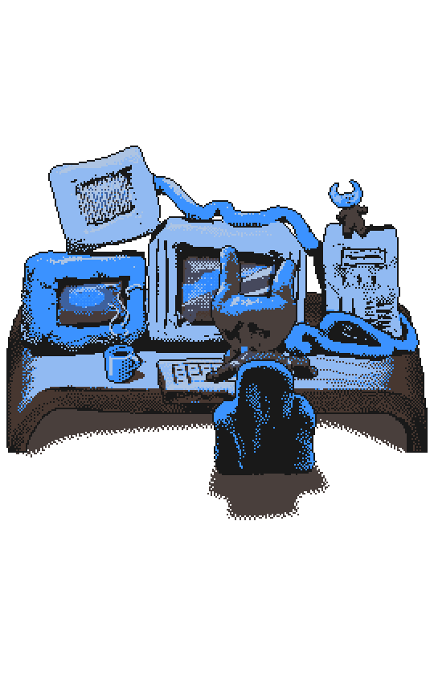
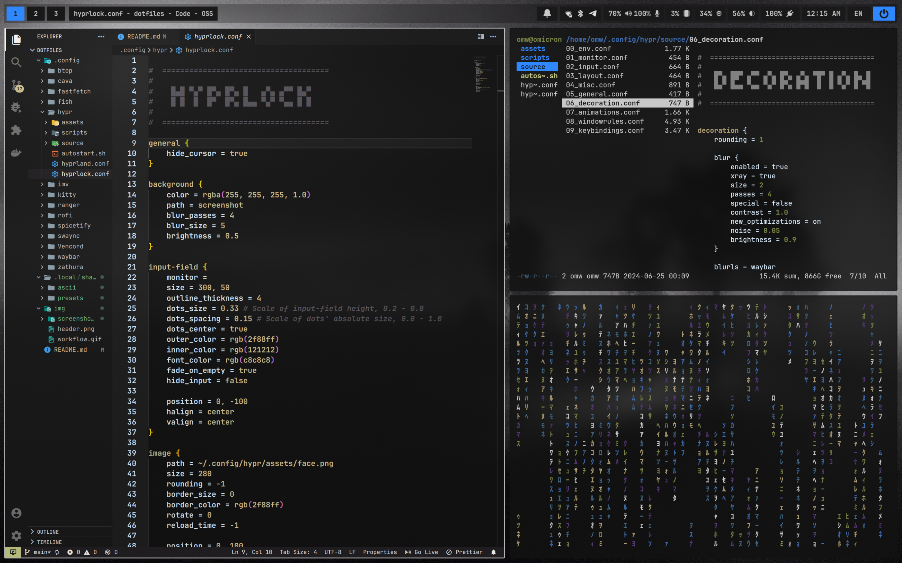
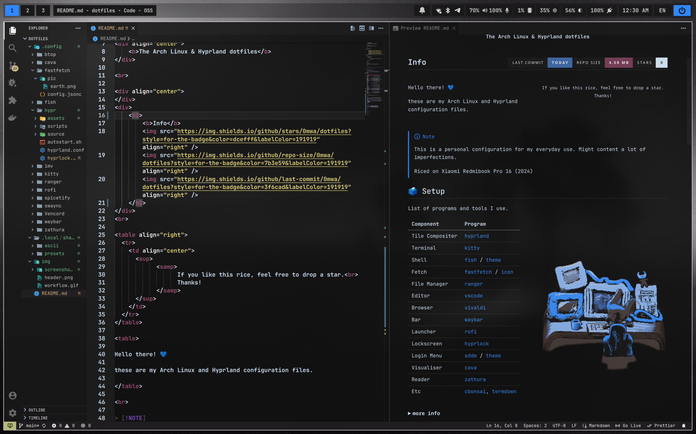

<div align="center">
    
</div>

<div align="center">
    <b>The Arch Linux & Hyprland dotfiles</b>
</div>

<!-- <br> -->

<!-- <div align="center">
  <a href="#setup"></a>
  <a href="#preview"></a>
  <a href="#colors"></a>
  <a href="#dependencies"></a>
  <a href="#keybindings"></a>
  <a href="#credits"></a>
</div> -->

<br>

<div align="center">
</div>
<div>
    <h2>
        <b>Info</b> 
          
        
         
    </h2>
</div>
<br>

<table align="right">
  <tr>
    <td align="center">
      <sup>
            <samp>
                  If you like this rice, feel free to drop a star.<br>
                  Thanks!
            </samp>
      </sup>
    </td>
  </tr>
</table>

<table>

Hello there! 💙 

these are my Arch Linux and Hyprland configuration files.

</table>

<br>

> [!NOTE]
> This is a personal configuration for my everyday use. Might content a lot of imperfections. 
>
> Riced on Xiaomi Redmibook Pro 16 (2024)

## Setup

List of programs and tools I use.

[](https://x.com/MasonLindroth)

| Component | Program                                                                                                                |
|-------------------|----------------------------------------------------------------------------------------------------------------|
| Tile Compositer   | [hyprland](https://github.com/hyprwm/Hyprland)                                                                 |
| Terminal          | [kitty](https://github.com/kovidgoyal/kitty)                                                                   |
| Shell             | [fish](https://github.com/fish-shell/fish-shell) / [theme](https://github.com/IlanCosman/tide)                 |
| Fetch             | [fastfetch](https://github.com/fastfetch-cli/fastfetch) / [icon](/.config/fastfetch/pic/earth.png)             |
| File Manager      | [ranger](https://github.com/ranger/ranger) / [dolphin](https://github.com/KDE/dolphin)                         |
| Editor            | [vscode](https://github.com/microsoft/vscode)                                                                  |
| Browser           | [vivaldi](https://vivaldi.com)                                                                                 |
| Bar               | [waybar](https://github.com/Alexays/Waybar)                                                                    |
| Launcher          | [rofi](https://github.com/davatorium/rofi)                                                                     |
| Lockscreen        | [hyprlock](https://github.com/hyprwm/hyprlock)                                                                 |
| Visualiser        | [cava](https://github.com/karlstav/cava)                                                                       |
| Login Menu        | [sddm](https://github.com/sddm/sddm) / [theme](https://github.com/stepanzubkov/where-is-my-sddm-theme)         |
| Wallpaper         | [swww](https://github.com/LGFae/swww) / [img](/img/wallpaper.png)

<br>

<details close>
    <summary><samp><b>more info</b></samp></summary>

<br>

- Font
  - [JetbrainsMono NF](https://github.com/ryanoasis/nerd-fonts) 
- Icons
  - [Papirus (White)](https://github.com/PapirusDevelopmentTeam/papirus-icon-theme)
- GTK
  - [Materia Dark Compact](https://github.com/nana-4/materia-theme)
- Cursor
  - [Bibata Modern Ice](https://github.com/ful1e5/Bibata_Cursor?tab=readme-ov-file)
- BootLoader
  - [Systemd-boot](https://github.com/systemd/systemd/blob/main/src/boot/efi/boot.c)
- Discord
  - [Vencord](https://github.com/Vendicated/Vencord) / [Midnight theme (Modified)](https://github.com/refact0r/midnight-discord)
- Spotify
  - [Spicetify](https://github.com/spicetify/cli) / [TUI-like theme (Modified)](https://github.com/spicetify/spicetify-themes/tree/master/text)
- Image viewer
  - [Imv](https://github.com/eXeC64/imv)
- Reader
  - [Zathura](https://github.com/pwmt/zathura) 
- Etc
  - [Cbonsai](https://github.com/mhzawadi/homebrew-cbonsai)
  - [Cmatrix](https://github.com/abishekvashok/cmatrix)
  - [Termdown](https://github.com/trehn/termdown)
  - [Ranger mount plugin](https://github.com/SL-RU/ranger_udisk_menu)

</details>

<br>     

## Preview






<br>

## Colors

<details close>
    <summary><samp><b>Show</b></samp></summary>

<br>

### Environment

- background: 
  -  normal: #121212  
  -  alt: #191919  
- foreground: 
  -  normal: #c8c8c8  
  -  alt: #ababab  
- accent:
  -  blue: #3f6cad  
  -  bright blue:#2f88ff  
  -  purple: #553976   
  -  bright purple: #8853c7  

### Text/terminal

- normal: 
  -  black: #211f21  
  -  red: #7b3e59  
  -  green:#798347  
  -  yellow: #ae9f76  
  -  blue: #3f6cad  
  -  magenta: #553976  
  -  cyan: #416680  
  -  white: #adc4e3  
- bright: 
  -  black: #302e31 
  -  red: #a55377 
  -  green: #c8cc86 
  -  yellow: #d9c793 
  -  blue: #2f88ff 
  -  magenta: #8853c7 
  -  cyan: #6dabd6 
  -  white: #dcefff 

### Content grey

- content:
  -  c1: #262422 
  -  c2: #3d3a37 
  -  c3: #4f4b47 
  -  c4: #66615c 
  -  c5: #7d7770 
  -  c6: #918a83 

### Supplementary

- normal:
  -  orange: #cc873f 
  -  pink: #b65685 
  -  brown: #473730 
- bright:
  -  orange: #cc9964 
  -  pink: #cc76a0 
  -  brown: #896a5d 

### Gradient

- 8bit: 
  -  1: #2f88ff 
  -  2: #3c81f7 
  -  3: #4f77eb 
  -  4: #616ce0 
  -  5: #6d64d8 
  -  6: #775ed2 
  -  7: #8257Cb 
  -  8: #8853c7 
- 16bit: 
  -  1: #2f88ff 
  -  2: #3684fa 
  -  3: #3c81f7 
  -  4: #437ef3 
  -  5: #497aef 
  -  6: #4f77eb 
  -  7: #5573e7 
  -  8: #5b70e4 
  -  9: #616ce0 
  -  10: #6768dc 
  -  11: #6d64d8 
  -  12: #7261d5 
  -  13: #775ed2 
  -  14: #7c5bcf 
  -  15: #8257cb 
  -  16: #8853c7 
    
</details>

<br>

## Dependencies

<details close>
    <summary><samp><b>Show</b></samp></summary>

<br>

### Yay

```shell
sudo pacman -S git base-devel
git clone https://aur.archlinux.org/yay.git  
cd yay  
makepkg -si 
```

### Hyprland

```shell
hyprland hyprlock xdg-desktop-portal-hyprland xorg-xwayland qt5-wayland qt6-wayland qt5ct qt6ct libva linux-headers xdg-desktop-portal-hyprland xdg-utils xorg-server xorg-xinit  
```

### Audio

```shell
pipewire pipewire-alsa pipewire-pulse gst-plugin-pipewire pipewire-jack pavucontrol wireplumber alsa-plugins alsa-tools alsa-utils libpulse sof-firmware sof-tools sox
```

### Components

```shell
swaync swww waybar btop discord dolphin fastfetch fish imv kitty nano ranger rofi-wayland sddm telegram-desktop vivaldi yt-dlp zathura zathura-djvu zathura-pdf-mupdf
```

### Utilities

```shell
acpica atool brightnessctl cliphist cpio efibootmgr htop intel-ucode less libnotify lxd man-db mokutil notification-daemon ntfs-3g smartmontools systemd-resolvconf yad unzip wget zram-generator
```

### AUR

```shell
bibata-cursor-theme cava cbonsai-git cmatrix-git grimblast-git hw-probe jetbrains-toolbox light nwg-look-bin papirus-folders-git qt5-styleplugins spicetify-cli spotify wg-client where-is-my-sddm-theme-git
```

### Development Tools

```shell
base-devel code dkms docker docker-compose git luarocks python-pillow python-pip python-pipx 
```

### Networking

```shell
bluez bluez-utils blueman iwd networkmanager network-manager-applet openssh wireless_tools wireguard-tools wpa_supplicant
```

### Video

```shell
cheese ffmpegthumbnailer intel-media-driver libva-intel-driver vulkan-intel
```

### Fonts / Themes
```shell
breeze lxappearance lxsession materia-gtk-theme noto-fonts noto-fonts-cjk noto-fonts-emoji papirus-icon-theme ttf-jetbrains-mono-nerd 
```

### Install
```shell
git clone https://github.com/0mwa/dotfiles.git
cp -R dotfiles/.config/* ~/.config/
cp -R dotfiles/.local/* ~/.local/
```

</details>

<br>

## Keybindings

<details close>
    <summary><samp><b>Show</b></samp></summary>

<br>

<div align="center">

| Keys                                                                                                   | Action                                         |
| :----------------------------------------------------------------------------------------------------- | :--------------------------------------------- |
| <kbd>Super</kbd> + <kbd>Q</kbd>                                                                        | Close focused window                           |
| <kbd>Super</kbd> + <kbd>X</kbd>                                                                        | Kill Hyprland session                          |
| <kbd>Super</kbd> + <kbd>F</kbd>                                                                        | Toggle the window between focus and float      |
| <kbd>Super</kbd> + <kbd>Shift</kbd> + <kbd>F</kbd>                                                     | Toggle the window between focus and fullscreen |
| <kbd>Super</kbd> + <kbd>L</kbd>                                                                        | Launch lock screen                             |
| <kbd>Super</kbd> + <kbd>P</kbd>                                                                        | Launch powermenu                               |
| <kbd>Super</kbd> + <kbd>Enter</kbd>                                                                    | Launch terminal emulator                       |
| <kbd>Super</kbd> + <kbd>E</kbd>                                                                        | Launch file manager                            |
| <kbd>Ctrl</kbd> + <kbd>Alt</kbd> + <kbd>Delete</kbd>                                                   | Launch system monitor                          |
| <kbd>Super</kbd> + <kbd>D</kbd>                                                                        | Launch application launcher                    |
| <kbd>Super</kbd> + <kbd>Tab</kbd>                                                                      | Launch window switcher                         |
| <kbd>Fn</kbd> + <kbd>F1</kbd>                                                                          | Toggle audio mute                              |
| <kbd>Fn</kbd> + <kbd>F2</kbd>                                                                          | Decrease volume                                |
| <kbd>Fn</kbd> + <kbd>F3</kbd>                                                                          | Increase volume                                |
| <kbd>Fn</kbd> + <kbd>F5</kbd>                                                                          | Increase brightness                            |
| <kbd>Fn</kbd> + <kbd>F6</kbd>                                                                          | Decrease brightness                            |
| <kbd>Super</kbd> + <kbd>Shift</kbd> + <kbd>S</kbd>                                                     | Area screenshot capture                        |
| <kbd>Super</kbd> + <kbd>Shift</kbd> + <kbd>X</kbd>                                                     | Full screenshot capture                        |
| <kbd>Super</kbd> + <kbd>Space</kbd>                                                                    | Switch keyboard layout                         |
| <kbd>Super</kbd> + <kbd>←</kbd><kbd>→</kbd><kbd>↑</kbd><kbd>↓</kbd>                                    | Move window focus                              |
| <kbd>Super</kbd> + <kbd>[0-9]</kbd>                                                                    | Switch workspaces                              |
| <kbd>Super</kbd> + <kbd>Ctrl</kbd> + <kbd>←</kbd><kbd>→</kbd>                                          | Resize windows                                 |
| <kbd>Super</kbd> + <kbd>Shift</kbd> + <kbd>←</kbd><kbd>→</kbd><kbd>↑</kbd><kbd>↓</kbd>                 | Move windows                                   |
| <kbd>Super</kbd> + <kbd>Shift</kbd> + <kbd>[0-9]</kbd>                                                 | Move focused window to a relative workspace    |
| <kbd>Super</kbd> + <kbd>Ctrl</kbd> + <kbd>Alt</kbd> + <kbd>←</kbd><kbd>→</kbd><kbd>↑</kbd><kbd>↓</kbd> | Move floating window                           |
| <kbd>Super</kbd> + <kbd>LeftClick</kbd><br><kbd>Super</kbd> + <kbd>Z</kbd>                             | Move focused window                            |
| <kbd>Super</kbd> + <kbd>RightClick</kbd><br><kbd>Super</kbd> + <kbd>C</kbd>                            | Resize focused window                          |
| <kbd>Super</kbd> + <kbd>J</kbd>                                                                        | Toggle focused window split                    |
| <kbd>Super</kbd> + <kbd>Alt</kbd> + <kbd>[0-9]</kbd>                                                   | Move focused window to a workspace silently    |

</div>

</details>

<br>

## Credits

- Colorscheme 
  - [Black Lotus](https://github.com/PoisonIsBestType/BlackLotus/tree/main)
- Fastfetch inspiration
  - [Bina's ff](https://github.com/LierB/fastfetch)
- Rofi & Powermenu 
  - [adi1090x presets collection](https://github.com/adi1090x/rofi/tree/master?tab=readme-ov-file)
